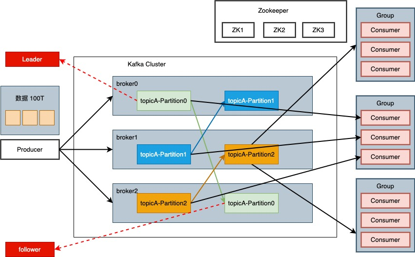

[[kafka-overview]]
= 概述

== 定义

Kafka 传统定义，Kafka 是一个分布式的基于 发布/订阅 模式的消息队列，主要应用于大数据实时处理领域

Kafka 最新定义：Kafka 是一个开源的分布式事件流平台，被数千家公司用于数据管道，流分析，数据集成和关键任务应用

== 消息队列

目前企业中比较常见的消息队列产品主要有 Kafka、ActiveMQ、RabbitMQ、 RocketMQ 等。

在大数据场景主要采用 Kafka 作为消息队列。在 JavaEE 开发中主要采用 ActiveMQ、 RabbitMQ、RocketMQ。

=== 应用场景

传统的消息队列主要应用于以下场景：

1. 异步处理：消息队列可以用于解耦系统中的不同组件，使得消息发送方和接收方之间的通信变为异步的。这样可以增加系统的可伸缩性和灵活性，提高系统的响应速度。

2. 应用解耦：消息队列可以将不同的应用程序解耦，使得它们之间的通信不再直接依赖。这样可以降低系统的复杂性，提高系统的可维护性和可扩展性。

3. 流量削峰：通过消息队列可以平滑处理系统中的峰值流量，避免系统因为突发的高并发请求而崩溃。消息队列可以暂时存储请求，然后按照系统的处理能力逐渐消费这些请求，从而有效控制系统的负载。

4. 日志处理：消息队列可以用于日志的收集和处理。应用程序可以将日志消息发送到消息队列中，然后由消费者进行处理、存储或分析。这样可以集中管理日志数据，并且不会因为日志处理的延迟影响应用程序的性能。

5. 事件驱动架构：消息队列可以与事件驱动架构结合使用，实现松耦合的组件之间的通信。通过消息队列发布和订阅事件，不同的组件可以实时地获取和处理事件，从而构建灵活和可扩展的系统架构。

需要注意的是，随着技术的不断进步和发展，现代的消息队列和事件驱动平台提供了更多的功能和特性，如事务支持、消息持久化、消息顺序保证等，可以满足更复杂的应用需求。

=== 模式

点对点模式和发布订阅模式是消息队列中常见的两种消息传递模式，它们有以下不同之处：

1. 点对点模式（Point-to-Point）：在点对点模式中，消息生产者将消息发送到具有唯一标识的队列中，而消息消费者则从队列中接收并处理消息。每个消息只能被一个消费者接收，类似于一对一的通信方式。当消息被一个消费者处理后，它将从队列中移除，其他消费者将无法接收到已经被处理的消息。

2. 发布订阅模式（Publish-Subscribe）：在发布订阅模式中，消息生产者将消息发布到一个主题（Topic）上，而消息消费者可以订阅并接收这个主题上的消息，消费者消费数据后，不删除数据。主题可以有多个订阅者，每个订阅者都会接收到发布到该主题的消息。这种模式类似于广播，一个消息可以被多个消费者接收。

总结来说，点对点模式适用于一对一的通信需求，每个消息只能被一个消费者接收处理。而发布订阅模式适用于一对多的通信需求，一个消息可以被多个消费者接收。不同的模式适用于不同的场景，根据实际需求选择合适的模式可以提高系统的灵活性和可伸缩性。

=== Kafka 基础架构

* Producer: 消息生产者，就是向 Kafka broker 中发送消息的客户端
* Consumer：消息消费者，就是向 Kafka broker 中取消息的客户端
* Consumer Group(CG):消费者组，由多个consumer组成。消费者组内每个消费者负责消费不同分区的数据，一个分区只能由一个组内消费者消费;消费者组之间互不 影响。所有的消费者都属于某个消费者组，即消费者组是逻辑上的一个订阅者。
* Broker:一台 Kafka 服务器就是一个 broker。一个集群由多个 broker 组成。一个 broker 可以容纳多个 topic。
* Topic:可以理解为一个队列，生产者和消费者面向的都是一个 topic。
* Partition:为了实现扩展性，一个非常大的 topic 可以分布到多个 broker(即服 务器)上，一个 topic 可以分为多个 partition，每个 partition 是一个有序的队列。
* Replica:副本。一个 topic 的每个分区都有若干个副本，一个 Leader 和若干个 Follower。
* Leader:每个分区多个副本的 “主”，生产者发送数据的对象，以及消费者消费数 据的对象都是 Leader。
* Follower:每个分区多个副本中的 “从”，实时从 Leader 中同步数据，保持和 Leader 数据的同步。Leader 发生故障时，某个 Follower 会成为新的 Leader。
