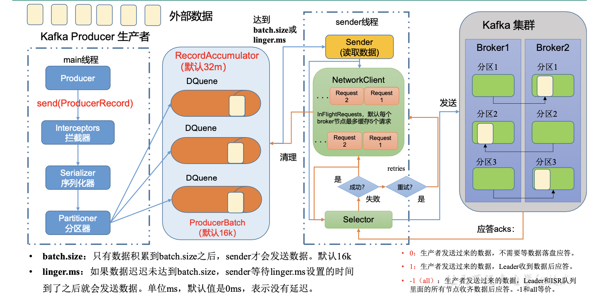
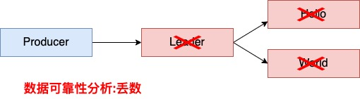
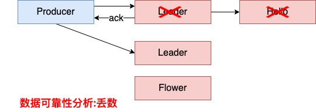
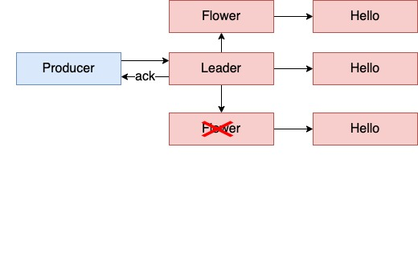
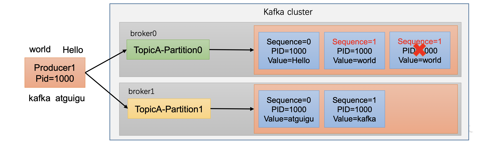
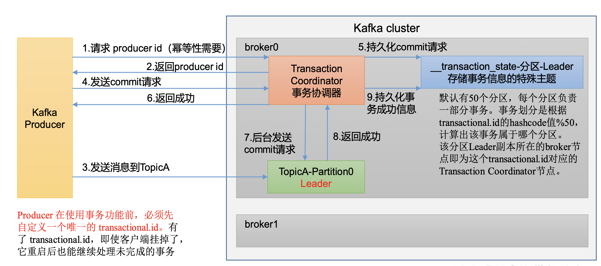

[[kafka-producer]]
= Kafka生产者

== 生产者消息发送流程

=== 发送原理

在消息发送的过程中，涉及到了两个线程—— main 线程和 Sender 线程。在 main 线程 中创建了一个双端队列 `RecordAccumulator`。
main 线程将消息发送给 `RecordAccumulator`， Sender 线程不断从 `RecordAccumulator` 中拉取消息发送到 Kafka Broker。

=== 生产者重要参数列表

|===
| 参数 | 描述

| bootstrap.servers
| 生产者连接集群所需的 broker 地址清单。例如 hadoop102:9092,hadoop103:9092,hadoop104:9092，可以 设置 1 个或者多个，中间用逗号隔开。注意这里并非需要所有的 broker 地址，因为生产者从给定的 broker 里查找到其他 broker 信息。

| key.serializer 和 value.serializer
| 指定发送消息的 key 和 value 的序列化类型。一定要写 全类名。

| buffer.memory
| RecordAccumulator 缓冲区总大小，默认 32m。

| batch.size
| 缓冲区一批数据最大值，默认 16k。适当增加该值，可 以提高吞吐量，但是如果该值设置太大，会导致数据 传输延迟增加。

| linger.ms
| 如果数据迟迟未达到 batch.size，sender 等待 linger.time 之后就会发送数据。单位 ms，默认值是 0ms，表示没 有延迟。生产环境建议该值大小为 5-100ms 之间。

| acks
| 0:生产者发送过来的数据，不需要等数据落盘应答。 1:生产者发送过来的数据，Leader 收到数据后应答。 -1(all):生产者发送过来的数据，Leader+和 isr 队列 里面的所有节点收齐数据后应答。默认值是-1，-1 和 all 是等价的。

| max.in.flight.requests.per.connection
| 允许最多没有返回 ack 的次数，默认为 5，开启幂等性 要保证该值是 1-5 的数字。

| retries
| 当消息发送出现错误的时候，系统会重发消息。retries 表示重试次数。默认是 int 最大值，2147483647。 如果设置了重试，还想保证消息的有序性，需要设置 MAX_IN_FLIGHT_REQUESTS_PER_CONNECTION=1 否则在重试此失败消息的时候，其他的消息可能发送 成功了。

| retry.backoff.ms
| 两次重试之间的时间间隔，默认是 100ms。

| enable.idempotence
| 是否开启幂等性，默认 true，开启幂等性。

| compression.type
| 生产者发送的所有数据的压缩方式。默认是 none，也 就是不压缩。 支持压缩类型:none、gzip、snappy、lz4 和 zstd。
|===

== 异步发送

=== 普通异步发送

[source,java]
----
public class CustomProducer {

	public static void main(String[] args) {

		// 1. 创建 kafka 生产者的配置对象
		Properties properties = new Properties();
		// 2. 给 kafka 配置对象添加配置信息:bootstrap.servers
		properties.put(ProducerConfig.BOOTSTRAP_SERVERS_CONFIG,"localhost:9092");
		// key,value 序列化
		properties.put(ProducerConfig.KEY_SERIALIZER_CLASS_CONFIG, StringSerializer.class);
		properties.put(ProducerConfig.VALUE_SERIALIZER_CLASS_CONFIG, StringSerializer.class);

		// 3. 创建 kafka 生产者对象
		KafkaProducer<String,String> kafkaProducer = new KafkaProducer<>(properties);

		// 4. 调用 send 方法,向 first 主题发送消息
		for (int i = 0; i < 5; i++) {
			kafkaProducer.send(new ProducerRecord<>("first","jcohy " + i));
		}
		// 5. 关闭资源
        kafkaProducer.close();
	}
}
----

在 kafka 上开启消费者，然后执行代码，来查看是否能接受到消息

[source,shell]
----
jcohy@jcohy-mac ~ % kafka-console-consumer --bootstrap-server localhost:9092 --topic first
jcohy 0
jcohy 1
jcohy 2
jcohy 3
jcohy 4
----

=== 带有回调的异步发送

回调函数会在 producer 收到 ack 时调用，为异步调用，该方法有两个参数，分别是元 数据信息(RecordMetadata)和异常信息(Exception)，如果 Exception 为 null，说明消息发 送成功，如果 Exception 不为 null，说明消息发送失败。

NOTE: 消息发送失败会自动重试，不需要我们在回调函数中手动重试。

[source,java]
----
public class CustomProducerCallback {
	public static void main(String[] args) {
		// 1. 创建 kafka 生产者的配置对象
		Properties properties = new Properties();
		// 2. 给 kafka 配置对象添加配置信息:bootstrap.servers
		properties.put(ProducerConfig.BOOTSTRAP_SERVERS_CONFIG,"localhost:9092");
		// key,value 序列化
		properties.put(ProducerConfig.KEY_SERIALIZER_CLASS_CONFIG, StringSerializer.class);
		properties.put(ProducerConfig.VALUE_SERIALIZER_CLASS_CONFIG, StringSerializer.class);

		// 3. 创建 kafka 生产者对象
		KafkaProducer<String,String> kafkaProducer = new KafkaProducer<>(properties);

		// 4. 调用 send 方法,向 first 主题发送消息
		for (int i = 0; i < 5; i++) {
			kafkaProducer.send(new ProducerRecord<>("first","jcohy " + i),
					(metadata, exception) -> { // // 该方法在Producer收到ack时调用，为异步调用
				if(exception == null) {
					// 没有异常,输出信息到控制台
					System.out.println(" 主 题 : " +
							metadata.topic() + "->" + "分区:" + metadata.partition());
				} else {
					exception.printStackTrace();
				}

			});
		}
		// 5. 关闭资源
		kafkaProducer.close();
	}
}
----

在 kafka 上开启消费者，然后执行代码，来查看是否能接受到消息

[source,shell]
----
jcohy@jcohy-mac ~ % kafka-console-consumer --bootstrap-server localhost:9092 --topic first
jcohy 0
jcohy 1
jcohy 2
jcohy 3
jcohy 4
----

. Idea 控制台输出
[source,text]
----
 主 题 : first->分区:0
 主 题 : first->分区:0
 主 题 : first->分区:0
 主 题 : first->分区:0
 主 题 : first->分区:0
----

== 同步发送

只需要在异步的基础上，再调用 `get()` 方法即可

[source,text]
----
kafkaProducer.send(new ProducerRecord<>("first","jcohy " + i)).get()
----

== 生产者分区

Kafka 分区有以下几点好处

* 便于合理使用存储资源，每个Partition在一个Broker上存储，可以把海量的数据按照分区切割成一块一块数据存储在多台 Broker 上。合理控制分区的任务，可以实现负载均衡的效果。
* 提高并行度，生产者可以以分区为单位发送数据;消费者可以以分区为单位进行消费数据。

=== 生产者分区策略

Kafka 生产者在发送消息时，可以选择使用不同的分区策略来确定消息应该被分配到哪个分区。下面是一些常见的分区策略：

1. 默认分区策略（DefaultPartitioner）：这是 Kafka 生产者的默认分区策略。它通过计算消息的哈希值，将消息均匀地分配到所有可用的分区中。

2. 指定分区策略（FixedPartitioner）：该策略允许生产者指定消息应发送到的具体分区。如果生产者在发送消息时明确指定了目标分区，则消息将直接发送到指定的分区。

3. 轮询分区策略（RoundRobinPartitioner）：该策略将按照轮询的方式依次选择可用的分区来发送消息。也就是说，连续的消息会被分配到不同的分区来实现负载均衡。

4. 自定义分区策略：除了上述内置的分区策略，你还可以自定义自己的分区策略，以满足特定的业务需求。自定义策略需要实现 Kafka 的 Partitioner 接口，并在生产者的配置中指定自定义分区器的类。

通过配置生产者的 `partitioner.class` 属性，可以选择使用不同的分区策略。要使用自定义的分区策略，请在代码中指定正确的分区类。

需要注意的是，分区策略只适用于没有显式指定目标分区的消息。如果在发送消息时指定了目标分区，那么分区策略将不会起作用，消息将直接发送到指定的分区。

==== DefaultPartitioner

默认分区策略

* 指明 partition 的情况下，直 接将指明的值作为 partition 值; 例如 partition=0，所有数据写入 分区 0
* 没有指明 partition 值但有 key 的情况下，将 key 的 hash 值与 topic 的 partition 数进行取余得到 partition 值; 例如:key1 的 hash 值是 5， key2 的 hash 值是 6 ，topic 的 partition 为 2，那 么 key1 对应的 value1 写入 1 号分区，key2 对应的 value2 写入 0 号分区。
* 既没有 partition 值又没有 key 值的情况下，Kafka 采用 Sticky Partition(黏性分区器)，会随机选择一个分区，并尽可能一直 使用该分区，待该分区的 batch 已满或者已完成，Kafka 再随机一个分区进行使用(和上一次的分区不同)。例如:第一次随机选择 0 号分区，等 0 号分区当前批次满了(默认 `16k`)或者 `linger.ms` 设置的时间到， Kafka 再随机一个分区进 行使用(如果还是0会继续随机)。

我们之前在发送消息时创建了 `ProducerRecord` 对象，让我们来看看它的构造函数

[source,java]
----
public class ProducerRecord<K, V> {

    /**
     * 创建一个具有指定时间戳的记录，并将其发送到指定的主题和分区。
     *
     * @param topic 发送的主题
     * @param partition 发送的分区
     * @param timestamp 消息的时间戳，单位毫秒，如果为 null，则使用 System.currentTimeMillis().
     * @param key 记录的 key
     * @param value 记录的内容
     * @param headers 记录的头部信息
     */
    public ProducerRecord(String topic, Integer partition, Long timestamp, K key, V value, Iterable<Header> headers) {
        if (topic == null)
            throw new IllegalArgumentException("Topic cannot be null.");
        if (timestamp != null && timestamp < 0)
            throw new IllegalArgumentException(
                    String.format("Invalid timestamp: %d. Timestamp should always be non-negative or null.", timestamp));
        if (partition != null && partition < 0)
            throw new IllegalArgumentException(
                    String.format("Invalid partition: %d. Partition number should always be non-negative or null.", partition));
        this.topic = topic;
        this.partition = partition;
        this.key = key;
        this.value = value;
        this.timestamp = timestamp;
        this.headers = new RecordHeaders(headers);
    }

    /**
     * 创建一个具有指定时间戳的记录，并将其发送到指定的主题和分区。
     *
     * @param topic 发送的主题
     * @param partition 发送的分区
     * @param timestamp 消息的时间戳，单位毫秒，如果为 null，则使用 System.currentTimeMillis().
     * @param key 记录的 key
     * @param value 记录的内容
     */
    public ProducerRecord(String topic, Integer partition, Long timestamp, K key, V value) {
        this(topic, partition, timestamp, key, value, null);
    }

    /**
     * 创建一个记录，并将其发送到指定的主题和分区。
     *
     * @param topic 发送的主题
     * @param partition 发送的分区
     * @param key 记录的 key
     * @param value 记录的内容
     * @param headers 记录的头部信息
     */
    public ProducerRecord(String topic, Integer partition, K key, V value, Iterable<Header> headers) {
        this(topic, partition, null, key, value, headers);
    }

    /**
     * 创建一个记录，并将其发送到指定的主题和分区。
     *
     * @param topic 发送的主题
     * @param partition 发送的分区
     * @param key 记录的 key
     * @param value 记录的内容
     */
    public ProducerRecord(String topic, Integer partition, K key, V value) {
        this(topic, partition, null, key, value, null);
    }

    /**
     *创建一个记录发送到 Kafka
     *
     * @param topic 发送的主题
     * @param key 记录的 key
     * @param value 记录的内容
     */
    public ProducerRecord(String topic, K key, V value) {
        this(topic, null, null, key, value, null);
    }

    /**
     * 创建一个没有 key 的记录
     *
     * @param topic 发送的主题
     * @param value 记录的内容
     */
    public ProducerRecord(String topic, V value) {
        this(topic, null, null, null, value, null);
    }
}
----

===== sample

首先我们创建 3 个分区的主题；

[source,shell]
----
jcohy@jcohy-mac ~ % kafka-topics --bootstrap-server localhost:9092 --create --partitions 3 --replication-factor 1 --topic sample-partition
Created topic sample-partition.
jcohy@jcohy-mac ~ % kafka-topics --bootstrap-server localhost:9092 --describe --topic sample-partition
Topic: sample-partition TopicId: 87hiax0URsGpjxwd0wxPGg PartitionCount: 3       ReplicationFactor: 1    Configs:
        Topic: sample-partition Partition: 0    Leader: 0       Replicas: 0     Isr: 0
        Topic: sample-partition Partition: 1    Leader: 0       Replicas: 0     Isr: 0
        Topic: sample-partition Partition: 2    Leader: 0       Replicas: 0     Isr: 0
jcohy@jcohy-mac ~ %
----

* 案例一: 将数据发往指定 partition 的情况下，例如，将所有数据发往分区 1 中。
+
[source,java]
----
public class CustomProducerCallbackPartitions {
	public static void main(String[] args) {
		// 1. 创建 kafka 生产者的配置对象
		Properties properties = new Properties();
		// 2. 给 kafka 配置对象添加配置信息:bootstrap.servers
		properties.put(ProducerConfig.BOOTSTRAP_SERVERS_CONFIG,"localhost:9092");
		// key,value 序列化
		properties.put(ProducerConfig.KEY_SERIALIZER_CLASS_CONFIG, StringSerializer.class);
		properties.put(ProducerConfig.VALUE_SERIALIZER_CLASS_CONFIG, StringSerializer.class);

		// 3. 创建 kafka 生产者对象
		KafkaProducer<String,String> kafkaProducer = new KafkaProducer<>(properties);

		// 4. 调用 send 方法,向 first 主题发送消息
		for (int i = 0; i < 5; i++) {
			kafkaProducer.send(new ProducerRecord<>("first",1,"","jcohy " + i),
					(metadata, exception) -> { // // 该方法在Producer收到ack时调用，为异步调用
				if(exception == null) {
					// 没有异常,输出信息到控制台
					System.out.println(" 主 题 : " +
							metadata.topic() + "->" + "分区:" + metadata.partition());
				} else {
					exception.printStackTrace();
				}

			});
		}
		// 5. 关闭资源
		kafkaProducer.close();
	}
}
----
+
在 kafka 上开启消费者，然后执行代码，来查看是否能接受到消息
+
[source,shell]
----
jcohy@jcohy-mac ~ % kafka-console-consumer --bootstrap-server localhost:9092 --topic sample-partition
jcohy 0
jcohy 1
jcohy 2
jcohy 3
jcohy 4

----
+
. Idea 控制台输出
[source,text]
----
 主 题 : sample-partition->分区:1
 主 题 : sample-partition->分区:1
 主 题 : sample-partition->分区:1
 主 题 : sample-partition->分区:1
 主 题 : sample-partition->分区:1
----

案例二：没有指明 partition 值但有 key 的情况下，将 key 的 hash 值与 topic 的 partition 数进行取余得到 partition 值。
+
[source,java]
----
public class CustomProducerCallbackWithKey {
	public static void main(String[] args) {
		// 1. 创建 kafka 生产者的配置对象
		Properties properties = new Properties();
		// 2. 给 kafka 配置对象添加配置信息:bootstrap.servers
		properties.put(ProducerConfig.BOOTSTRAP_SERVERS_CONFIG,"localhost:9092");
		// key,value 序列化
		properties.put(ProducerConfig.KEY_SERIALIZER_CLASS_CONFIG, StringSerializer.class);
		properties.put(ProducerConfig.VALUE_SERIALIZER_CLASS_CONFIG, StringSerializer.class);

		// 3. 创建 kafka 生产者对象
		KafkaProducer<String,String> kafkaProducer = new KafkaProducer<>(properties);

		// 4. 调用 send 方法,向 first 主题发送消息.依次指定 key 值为 a,b,f ，数据 key 的 hash 值与 3 个分区求余， 分别发往 1、2、0
		send(kafkaProducer,"a");
		send(kafkaProducer,"b");
		send(kafkaProducer,"f");

		// 5. 关闭资源
		kafkaProducer.close();
	}

	public static void send(KafkaProducer<String,String> kafkaProducer,String key) {
		for (int i = 0; i < 5; i++) {
			kafkaProducer.send(new ProducerRecord<>("sample-partition",key,"jcohy " + i),
					(metadata, exception) -> { // // 该方法在Producer收到ack时调用，为异步调用
						if(exception == null) {
							// 没有异常,输出信息到控制台
							System.out.println(" 主 题 : " +
									metadata.topic() + "->" + "分区:" + metadata.partition());
						} else {
							exception.printStackTrace();
						}

					});
		}
	}
}
----
+
在 kafka 上开启消费者，然后执行代码，来查看是否能接受到消息
+
. key="a" 时。Idea 控制台输出
[source,text]
----
 主 题 : sample-partition->分区:0
 主 题 : sample-partition->分区:0
 主 题 : sample-partition->分区:0
 主 题 : sample-partition->分区:0
 主 题 : sample-partition->分区:0
----
+
. key="b" 时。Idea 控制台输出
[source,text]
----
 主 题 : sample-partition->分区:1
 主 题 : sample-partition->分区:1
 主 题 : sample-partition->分区:1
 主 题 : sample-partition->分区:1
 主 题 : sample-partition->分区:1
----
+
. key="f" 时。Idea 控制台输出
[source,text]
----
 主 题 : sample-partition->分区:2
 主 题 : sample-partition->分区:2
 主 题 : sample-partition->分区:2
 主 题 : sample-partition->分区:2
 主 题 : sample-partition->分区:2
----

=== 自定义分区器

例如我们实现一个分区器实现，发送过来的数据中如果包含 jcohy，就发往 0 号分区，不包含 jcohy，就发往 1 号分区。

实现步骤

. 定义类实现 Partitioner 接口。
. 重写 partition()方法。

[source,java]
----
public class CustomPartitioner implements Partitioner {
	@Override
	public void close() {

	}

	@Override
	public void configure(Map<String, ?> configs) {

	}

	/**
	 * 返回信息对应的分区
	 *
	 * @param topic 主题
	 * @param key 消息的 key
	 * @param keyBytes 消息的 key 序列化后的字节数组
	 * @param value 消息的 value
	 * @param valueBytes 消息的 value 序列化后的字节数组
	 * @param cluster 集群元数据可以查看分区信息
	 * @return /
	 */
	@Override
	public int partition(String topic, Object key, byte[] keyBytes, Object value, byte[] valueBytes, Cluster cluster) {
		// 获取消息
		String msgValue = value.toString();
		int partition;
		// 判断消息是否包含 jcohy
		if (msgValue.contains("jcohy")){
			partition = 0;
		}else {
			partition = 1;
		}
		// 返回分区号
		return partition;
	}
}
----

[source,java]
----
public class CustomProducerCallbackWithCustomPartition {
	public static void main(String[] args) {
		// 1. 创建 kafka 生产者的配置对象
		Properties properties = new Properties();
		// 2. 给 kafka 配置对象添加配置信息:bootstrap.servers
		properties.put(ProducerConfig.BOOTSTRAP_SERVERS_CONFIG,"localhost:9092");
		// key,value 序列化
		properties.put(ProducerConfig.KEY_SERIALIZER_CLASS_CONFIG, StringSerializer.class);
		properties.put(ProducerConfig.VALUE_SERIALIZER_CLASS_CONFIG, StringSerializer.class);
		properties.put(ProducerConfig.PARTITIONER_CLASS_CONFIG, CustomPartitioner.class);

		// 3. 创建 kafka 生产者对象
		KafkaProducer<String,String> kafkaProducer = new KafkaProducer<>(properties);

		// 4. 调用 send 方法,向 first 主题发送消息.依次指定 key 值为 a,b,f ，数据 key 的 hash 值与 3 个分区求余， 分别发往 1、2、0
		send(kafkaProducer,"jcohy");
		send(kafkaProducer,"hello");
		send(kafkaProducer,"jcohy11");

		// 5. 关闭资源
		kafkaProducer.close();
	}

	public static void send(KafkaProducer<String,String> kafkaProducer,String value) {
		for (int i = 0; i < 5; i++) {
			kafkaProducer.send(new ProducerRecord<>("sample-partition",value+ i),
					(metadata, exception) -> { // // 该方法在Producer收到ack时调用，为异步调用
						if(exception == null) {
							// 没有异常,输出信息到控制台
							System.out.println(" 主 题 : " +
									metadata.topic() + "->" + "分区:" + metadata.partition());
						} else {
							exception.printStackTrace();
						}

					});
		}
	}
}
----

在 kafka 上开启消费者，然后执行代码，来查看是否能接受到消息

. 当 value 包含"jcohy",Idea 控制台输出
[source,text]
----
 主 题 : sample-partition->分区:0
 主 题 : sample-partition->分区:0
 主 题 : sample-partition->分区:0
 主 题 : sample-partition->分区:0
 主 题 : sample-partition->分区:0
----

. 当 value 不包含"jcohy",Idea 控制台输出
[source,text]
----
 主 题 : sample-partition->分区:1
 主 题 : sample-partition->分区:1
 主 题 : sample-partition->分区:1
 主 题 : sample-partition->分区:1
 主 题 : sample-partition->分区:1
----

== 生产者如何提高吞吐量

* batch.size:批次大小，默认16k
* linger.ms:等待时间，修改为 5-100ms，一次拉一个， 来了就走
* compression.type:压缩 snappy
* RecordAccumulator:缓冲区大小，修改为64m

[source,java]
----
public class CustomProducerParameters {

	public static void main(String[] args) {
		// 1. 创建 kafka 生产者的配置对象
		Properties properties = new Properties();
		// 2. 给 kafka 配置对象添加配置信息:bootstrap.servers
		properties.put(ProducerConfig.BOOTSTRAP_SERVERS_CONFIG,"localhost:9092");
		// key,value 序列化
		properties.put(ProducerConfig.KEY_SERIALIZER_CLASS_CONFIG, StringSerializer.class);
		properties.put(ProducerConfig.VALUE_SERIALIZER_CLASS_CONFIG, StringSerializer.class);

		// batch.size:批次大小，默认16K
		properties.put(ProducerConfig.BATCH_SIZE_CONFIG, 16384);
		// linger.ms:等待时间，默认 0
		properties.put(ProducerConfig.LINGER_MS_CONFIG, 1);
		// RecordAccumulator:缓冲区大小，默认 32M:buffer.memory
		properties.put(ProducerConfig.BUFFER_MEMORY_CONFIG,33554432);
		// compression.type:压缩，默认 none，可配置值 gzip、snappy、 lz4 和 zstd
		properties.put(ProducerConfig.COMPRESSION_TYPE_CONFIG,"snappy");

		// 3. 创建 kafka 生产者对象
		KafkaProducer<String,String> kafkaProducer = new KafkaProducer<>(properties);

		// 4. 调用 send 方法,向 first 主题发送消息
		for (int i = 0; i < 5; i++) {
			kafkaProducer.send(new ProducerRecord<>("sample-partition","jcohy " + i),
					(metadata, exception) -> { // // 该方法在Producer收到ack时调用，为异步调用
						if(exception == null) {
							// 没有异常,输出信息到控制台
							System.out.println(" 主 题 : " +
									metadata.topic() + "->" + "分区:" + metadata.partition());
						} else {
							exception.printStackTrace();
						}

					});
		}
		// 5. 关闭资源
		kafkaProducer.close();
	}
}
----

== 数据的可靠性

ack 应答原理

* 0:生产者发送过来的数据，不需要等数据落盘应答
+

* 1:生产者发送过来的数据，Leader收到数据后应答。
+

* -1(all):生产者发送过来的数据，Leader 和 ISR 队列里面 的所有节点收齐数据后应答。

Leader 收到数据，所有 Follower 都开始同步数据，但有一个 Follower，因为某种故障，迟迟不能与 Leader 进行同步，那这个问题怎么解决呢?

Leader 维护了一个动态的 in-sync replica set(ISR)，意为和 Leader 保持同步的 Follower+Leader 集合(leader:0，isr:0,1,2)。
如果 Follower 长时间未向 Leader 发送通信请求或同步数据，则 该 Follower 将被踢出 ISR。该时间阈值由 `replica.lag.time.max.ms` 参 数设定，默认 `30s`。例如 2 超时，(leader:0, isr:0,1)。
这样就不用等长期联系不上或者已经故障的节点。

数据可靠性分析:

如果分区副本设置为 1 个，或者 ISR 里应答的最小副本数量 ( `min.insync.replicas` 默认为 1)设置为 1，和 `ack=1` 的效果是一 样的，仍然有丢数的风险(leader:0，isr:0)。

**数据完全可靠条件 = ACK级别设置为-1 + 分区副本大于等于2 + ISR里应答的最小副本数量大于等于2**

可靠性总结:

* `acks=0`，生产者发送过来数据就不管了，可靠性差，效率高;
* `acks=1`，生产者发送过来数据Leader应答，可靠性中等，效率中等;
* `acks=-1`，生产者发送过来数据 Leader 和 ISR 队列里面所有 Follwer 应答，可靠性高，效率低;

在生产环境中，`acks=0` 很少使用; `acks=1` 一般用于传输普通日志，允许丢个别数据;acks=-1，一般用于传输和钱相关的数据， 对可靠性要求比较高的场景。

代码配置

[source,text]
----
// 设置应答级别
properties.put(ProducerConfig.ACKS_CONFIG,"all");
// 设置重试次数
properties.put(ProducerConfig.RETRIES_CONFIG,1);
----

== 数据的重复性

数据传递语义:

* 至少一次(At Least Once)= ACK 级别设置为-1 +分区副本大于等于 2+ISR 里应答的最小副本数量大于等于 2
* 最多一次(At Most Once)= ACK 级别设置为 0

* At Least Once 可以保证数据不丢失，但是不能保证数据不重复;
* At Most Once 可以保证数据不重复，但是不能保证数据不丢失。

精确一次(Exactly Once):对于一些非常重要的信息，比如和钱相关的数据，要求数据既不能重复也不丢失。

Kafka 0.11 版本以后，引入了一项重大特性:幂等性和事务。

=== 幂等性

幂等性就是指 Producer 不论向 Broker 发送多少次重复数据，Broker 端都只会持久化一条，保证了不重复。
精确一次(Exactly Once) = 幂等性 + 至少一次( ack=-1 + 分区副本数>=2 + ISR最小副本数量>=2) 。

重复数据的判断标准:具有 `<PID, Partition, SeqNumber>` 相同主键的消息提交时，Broker 只会持久化一条。其中 PID 是 Kafka 每次重启都会分配一个新的 id;
Partition 表示分区号;Sequence Number 是单调自增的。
所以幂等性只能保证的是在单分区单会话内不重复。

* 开启参数 `enable.idempotence` 默认为 `true`，`false` 关闭。

=== 事务

Kafka 事务原理

NOTE: 开启事务，必须开启幂等性

[source,java]
----
public class CustomProducerTransactions {

	public static void main(String[] args) {

		// 1. 创建 kafka 生产者的配置对象
		Properties properties = new Properties();
		// 2. 给 kafka 配置对象添加配置信息:bootstrap.servers
		properties.put(ProducerConfig.BOOTSTRAP_SERVERS_CONFIG,"localhost:9092");
		// key,value 序列化
		properties.put(ProducerConfig.KEY_SERIALIZER_CLASS_CONFIG, StringSerializer.class);
		properties.put(ProducerConfig.VALUE_SERIALIZER_CLASS_CONFIG, StringSerializer.class);

		// 需要确保全局唯一
		properties.put(ProducerConfig.TRANSACTIONAL_ID_CONFIG,"Transactions");
		// 3. 创建 kafka 生产者对象
		KafkaProducer<String,String> kafkaProducer = new KafkaProducer<>(properties);

		// 初始化事务
		kafkaProducer.initTransactions();;
		// 开始事务
		kafkaProducer.beginTransaction();
		try{
			// 4. 调用 send 方法,向 first 主题发送消息
			for (int i = 0; i < 5; i++) {
				kafkaProducer.send(new ProducerRecord<>("first","jcohy " + i));
			}
			// 模拟事务失败
			int a = 1/0;
			// 提交事务
			kafkaProducer.commitTransaction();
		} catch (Exception ex) {
			// 事务回滚
			kafkaProducer.abortTransaction();
		} finally {
			// 5. 关闭资源
			kafkaProducer.close();
		}
	}
}
----

== 数据有序

单分区内，有序(有条件的，详见下节); 多分区，分区与分区间无序;

== 数据乱序

* kafka在 1.x 版本之前保证数据单分区有序，条件如下: `max.in.flight.requests.per.connection=1` (不需要考虑是否开启幂等性)。
* kafka在 1.x及以后版本保证数据单分区有序， 条件如下:
** 未开启幂等性 `max.in.flight.requests.per.connection` 需要设置为 `1`。
** 开启幂等性 `max.in.flight.requests.per.connection` 需要设置小于等于 `5`。 原因说明:因为在 kafka1.x 以后，启用幂等后，kafka 服务端会缓存 producer 发来的最近 5 个 request 的元数据，
故无论如何，都可以保证最近 5 个 request d的数据都是有序的。
